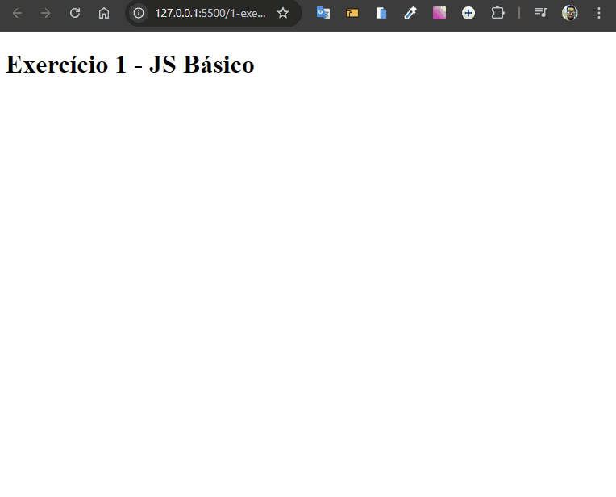

# Apresentação de Mensagem na Interativa na Tela

Desenvolvido como exercício de JavaScript básico do curso de extensão universitária do DevQuest - Dev em Dobro.

O objetivo é exibir uma mensagem na tela utilizando HTML e JavaScript.
Criar uma interface limpa e funcional onde uma mensagem é apresentada automaticamente ao usuário.



## Tecnologias Utilizadas

- **HTML**
- **JavaScript**

## Como Usar

1. Clone este repositório:

   ```bash
   git clone https://github.com/Alberesbass/apresentacao-de-mensagem-na-tela.git
   ```

2. Abra o arquivo `index.html` em seu navegador para visualizar a apresentação da mensagem e poder interagir com ela.

## Licença

Este projeto está sob a licença MIT. Consulte o arquivo [LICENSE](./LICENSE) para mais informações.

---

Desenvolvido por [Alberes](https://github.com/Alberesbass)